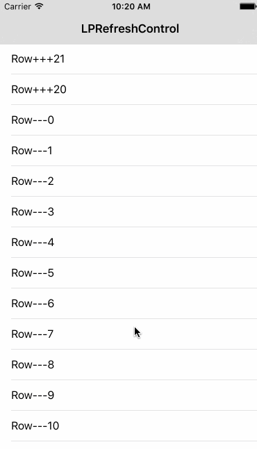

# LPRefreshControl

easier and convenient refresh control util for [SVPullToRefresh](https://github.com/samvermette/SVPullToRefresh).

# Installation

```swift
pod 'LPRefreshControl', '~> 1.0.0'
```

#Usage

```swift
/** add scrollView top pullToRefresh  */
[[LPRefreshControl sharedInstance] addRefreshInView:self.tableView atPosition:RefreshPositionTop withHandler:^{
    //refresh handler
}];
/** add scrollView bottom infiniteRefresh  */
[[LPRefreshControl sharedInstance] addRefreshInView:self.tableView atPosition:RefreshPositionBottom withHandler:^{
    //infiniteRefresh handler
}];
/** add scrollView top pullToRefresh & bottom infiniteRefresh  */
[[LPRefreshControl sharedInstance] addRefreshInView:self.tableView withTopHandler:^{
    //refresh handler
} andBottomHandler:^{
    //infiniteRefresh handler
}];
/** trigger top pullToRefresh or bottom infiniteRefresh */
[[LPRefreshControl sharedInstance] triggerRefreshInView:self.tableView atPosition:RefreshPositionTop];
[[LPRefreshControl sharedInstance] triggerRefreshInView:self.tableView atPosition:RefreshPositionBottom];
```
# Screenshot



# Release Notes

- 1.0.0

# License

MIT
